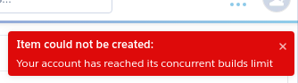

# Desafio

Olá primeiramente agradeço a Deus por ter me ajudado a me manter focado e segundo a vocês pela oportunidade que me deixou muito empolgado e focado.

Infelizmente não consegui colocar no heroku, pois apresentava essa opção me deixando de fora:



## Routes

POST /users cria um novo usuário
```js
routes.post('/users', ValidateUserStore, UserController.store);
```

POST /sesions cria uma sessão para o usuário
```js
routes.post('/sessions', ValidateSessionStore, SessionController.store);
```

PUT /users atualiza um usuário
```js
routes.put('/users', ValidateUserUpdate, UserController.update);
```

Usa um middleware para setar um token com um usuário
```js
routes.use(authMiddleware);
```

GET /users lista todos os usuário
```js
routes.get('/users', ProviderController.index);
```

GET /users/:name visualiza informaçoes de um usuário
```js
routes.get('/users/:name', ProviderController.show);
```

POST /github Cria uma pasta de usuário
```js
routes.post('/github', ValidateGithubStore, GithubController.store);
```

POST /github Atualiza a pasta de usuário
```js
routes.put('/github', ValidateGithubUpdate, GithubController.update);
```
POST /github Deleta a pasta de usuário
```js
routes.delete('/github/:id', GithubController.delete);
```
